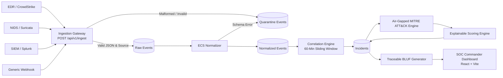

# SentinelIQ 🛡️
### Threat Intelligence Correlation & Alert Prioritisation Assistant
**Built by Team Binary Knights for BOB AI Hackathon**

[](file:///c:/Users/deeps/Desktop/D2%20Hackathon/server/tests)
[](#technology-stack)
[](#air-gapped-architecture)
[](#license)

---

## 📌 Overview

**SentinelIQ** is an autonomous threat intelligence correlation and alert prioritization engine designed to combat alert fatigue in modern Security Operations Centers (SOCs). Modern SOC analysts face thousands of disconnected alerts daily across heterogeneous sensors (EDR, SIEM, NIDS). SentinelIQ aggregates, normalizes to Elastic Common Schema (ECS), deduplicates, and correlates these disparate streams into high-confidence attack incidents while enforcing non-negotiable **Human-in-the-Loop** containment standards.

### 🌟 Key Highlights
- **Zero Silent Data Loss (Quarantine Guard):** Malformed, corrupt, or schema-invalid raw payloads are never dropped; they route into a dedicated, inspectable Quarantine store for manual analyst review and replay.
- **100% Explainable Scoring Engine:** Zero black-box magic numbers. Every priority score ($0-100$) and confidence rating ($0-100\%$) includes an explicit, mathematically weighted factor attribution array visible in the UI.
- **Human-in-the-Loop Closure:** Architectural mandate — alerts are never closed autonomously. Incident containment and status updates require explicit operator identity and justification rationale.
- **Traceable BLUF Intelligence Desk:** Generates Bottom Line Up Front (BLUF) executive summaries where every finding is clickable and cited directly to source event telemetry references.
- **Air-Gapped MITRE ATT&CK® Matrix (v14.1):** Offline embedded mirror providing full tactic and technique matrix mapping without requiring external API access or egress connectivity.
- **Query-Layer TLP / RBAC Clearance:** Traffic Light Protocol (`TLP:CLEAR`, `TLP:GREEN`, `TLP:AMBER`, `TLP:RED`) and Role-Based Access Control (`ANALYST`, `COMMANDER`, `ADMIN`) are enforced directly inside MongoDB queries to prevent unauthorized data leakage.

---

## 🏛️ Architecture & Data Flow



---

## 🚀 Getting Started

### Prerequisites
- **Node.js** 18.x or higher
- **npm** 9.x or higher
- *(Optional)* **Docker & Docker Compose** (if running via containers)
- *Note:* SentinelIQ includes an automatic in-memory MongoDB fallback (`mongodb-memory-server`), allowing the system to run out of the box with zero external database configuration!

---

### Quick Installation & Launch

1. **Clone the Repository:**
   ```bash
   git clone https://github.com/Yugsatodiya2008/bob-ai-hackathon--Binary-Knights-.git
   cd bob-ai-hackathon--Binary-Knights-
   ```

2. **Install Root and Workspace Dependencies:**
   ```bash
   npm install
   npm install --prefix server
   npm install --prefix client
   ```

3. **Launch SentinelIQ (Backend + Frontend):**

   *Terminal 1 (Backend Engine on Port 5000):*
   ```bash
   npm run server
   ```
   > ℹ️ *The server automatically bootstraps an in-memory database and auto-seeds multi-stage APT, ransomware precursor, and reconnaissance scenarios.*

   *Terminal 2 (Frontend SOC Commander on Port 3000):*
   ```bash
   npm run client
   ```

4. **Access the Dashboard:**
   Open your browser to: **`http://localhost:3000`**

---

## 🧪 Verification & Testing

SentinelIQ features an automated test suite verifying all architectural requirements and constraints:

```bash
npm test --prefix server
```

### Test Coverage Results:
```text
Test Suites: 7 passed, 7 total
Tests:       25 passed, 25 total
Snapshots:   0 total
Time:        7.216 s
```

- `schemas.test.js`: Validates all MongoDB models, required factors, and field integrity.
- `ingest_quarantine.test.js`: Proves zero silent data loss (`total_persisted == total_sent`).
- `normalization.test.js`: Verifies multi-source mapping into Elastic Common Schema (ECS).
- `correlation.test.js`: Verifies graph linking and 60-minute sliding window temporal deduplication.
- `scoring_explainability.test.js`: Enforces that all priority scores contain non-empty factor breakdowns.
- `bluf_traceability.test.js`: Confirms BLUF claims are cited to valid event IDs and validates human approval gates.
- `tlp_rbac_audit.test.js`: Verifies query-layer TLP redaction and immutable audit logging.

---

## 🖥️ SOC Commander Dashboard Features

1. **Ranked Triage Queue (`FR-6.2`):**
   Prioritizes incidents by multi-factor score, highlighting asset criticality, blast radius, and corroboration count.
2. **Explainable Factors Modal (`§0 #2`):**
   Clicking **"View Factors"** breaks down the exact percentage weights (e.g. Asset Criticality: 30%, Threat Alignment: 30%, Blast Radius: 20%, Data Sensitivity: 20%) and plain-English reasons.
3. **Interactive Persona & Clearance Switcher (`FR-11.1`):**
   Switch instantly between **Sarah Vance** (Analyst, `TLP:AMBER`), **Alex Mercer** (Junior, `TLP:GREEN`), **Elena Rostova** (Commander, `TLP:RED`), and **Marcus Vance** (Admin) to see live query-layer TLP filtering.
4. **Traceable BLUF Intelligence Desk (`FR-7.1`, `FR-7.3`):**
   Executive summary with clickable telemetry citations, threat trajectories, and mandatory approval/lock state transitions.
5. **MITRE ATT&CK Matrix Matrix (`FR-5.3`):**
   Air-gapped matrix visualization covering Reconnaissance, Initial Access, Execution, Persistence, Privilege Escalation, Defense Evasion, Credential Access, Discovery, Lateral Movement, Collection, and Command & Control.
6. **Ingestion Quarantine Manager (`FR-1.3`):**
   Review malformed or corrupted raw payloads with full error diagnostics and replay capabilities.
7. **SOC Audit Trail (`FR-12.2`):**
   Tamper-evident, immutable activity log tracking all analyst status changes, approvals, and report locks.

---

## 🛠️ Technology Stack

| Layer | Technologies |
| :--- | :--- |
| **Frontend** | React 19, Vite, Vanilla CSS Design System (Dark Glassmorphism SOC Theme) |
| **Backend** | Node.js, Express 4, Mongoose, Zod Schema Validation |
| **Storage & Database** | MongoDB (Production) / MongoMemoryServer (Zero-Config Dev & Test Mode) |
| **Threat Intel** | MITRE ATT&CK® Enterprise v14.1 (Embedded Air-Gapped Mirror) |
| **Testing** | Jest, Supertest |
| **Standards** | Elastic Common Schema (ECS), Traffic Light Protocol (TLP 2.0), RBAC |

---

## 👥 Team — Binary Knights
- **Project:** BOB AI Hackathon 2026
- **Repository:** [https://github.com/Yugsatodiya2008/bob-ai-hackathon--Binary-Knights-](https://github.com/Yugsatodiya2008/bob-ai-hackathon--Binary-Knights-)

---

## 📄 License
This project is licensed under the MIT License.
